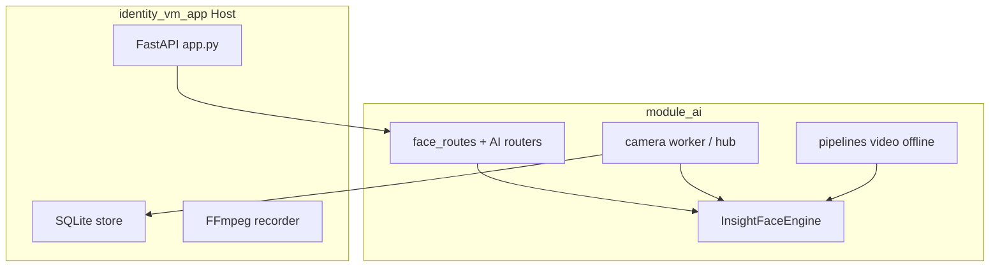

# module_ai — Backend AI (bàn giao / handoff)

## Tổng quan / Overview

**Tiếng Việt:** `module_ai/` gom toàn bộ logic ML/inference và API/pipeline AI của Identity VM: InsightFace (embedding 512-d), YOLO person/track, pose refine, weapon YOLO, nhận diện camera live và phân tích video offline. Ứng dụng host `identity_vm_app` vẫn chạy qua `python main.py` nhờ shim re-export; entry point không đổi.

**English:** `module_ai/` consolidates ML inference and AI HTTP/pipelines for Identity VM. The host app (`identity_vm_app`) mounts these routers and wires SQLite/RTSP; run from repo root as before.



## Khả năng / Capabilities

| Tính năng | Module |
|-----------|--------|
| Detect / embed / identify ảnh | `engine/`, `api/face_routes.py` |
| Face DB + FAISS/sklearn search | `persistence/` |
| Camera live infer | `camera/` |
| Video offline analyze | `pipelines/video_offline_analyze.py` |
| Person+weapon+face pipeline | `pipelines/video_person_face_pipeline.py` |
| Bulk folder register | `jobs/bulk_folder_register.py` |
| People gallery API | `api/people_routes.py` |
| Weapon alerts | `api/weapon_alerts_routes.py` |

## Yêu cầu / Requirements

- Python 3.10+
- NVIDIA GPU + CUDA (khuyến nghị)
- FFmpeg: dùng bởi **host** cho archive/preview/export (không bắt buộc chỉ để import `module_ai`)
- Weights YOLO/vũ khí trong `module_ai/models/` (xem `models/README.md`)

## Cài đặt nhanh / Quick start

```bash
cd app_face
pip install -r requirements.txt
# Hoặc chỉ ML:
pip install -r module_ai/requirements-ai.txt
```

Copy `yolo26s.pt`, `yolo26m-pose.pt`, `weapon_detect.pt` vào `module_ai/models/`. InsightFace `buffalo_l`: giải nén vào `module_ai/models/buffalo_l/` (mặc định **không** tự tải — `IVM_INSIGHTFACE_AUTO_DOWNLOAD=0`).

Chạy API (host):

```bash
python main.py --no-camera
```

## Cấu trúc / Layout

```text
module_ai/
├── config/settings.py    # IVM_* AI/model
├── engine/               # InsightFace, YOLO, pose, GPU cleanup
├── persistence/          # FaceDatabase
├── models/               # *.pt (gitignored)
├── camera/               # hub, worker, infer
├── pipelines/            # video offline, weapon crops
├── jobs/                 # bulk register
├── utils/text.py
└── api/                  # face_routes, people, infer, video-analyze, …
```

**PYTHONPATH:** Chạy từ thư mục gốc repo (`app_face/`) — `main.py` đã thêm root vào `sys.path`.

## Tích hợp Python / Python integration

```python
from module_ai.engine import InsightFaceEngine
from module_ai.persistence import FaceDatabase
from module_ai.config import settings as s

eng = InsightFaceEngine()
db = FaceDatabase(str(s.IVM_FACE_DB_DIR), use_faiss=s.IVM_USE_FAISS)  # host path via identity_vm_app.settings
```

Video pipeline: `module_ai.pipelines.video_person_face_pipeline.run_person_track_weapon_face_pipeline`  
Live camera: `module_ai.camera.hub.ensure_recognition_hub_started()`

## HTTP / HTTP integration

Host mount tại `/ivm` (xem OpenAPI `/docs`):         

| Nhóm | Ví dụ |
|------|--------|
| Health / register / identify | `GET /ivm/health`, `POST /ivm/register`, `POST /ivm/identify_images` |
| Bulk | `POST /ivm/admin/register-folder` |
| Camera infer | `GET /ivm/cameras/{id}/infer/mjpeg` |
| Video analyze | `POST /ivm/video-analyze/jobs` |
| Weapon | `GET /ivm/weapon-alerts/live` |

## Biến môi trường / Environment (AI)

| Biến | Mô tả |
|------|--------|
| `IVM_INSIGHTFACE_MODEL_NAME` | Pack InsightFace (mặc định `buffalo_l`) |
| `IVM_DISTANCE_THRESHOLD` | Ngưỡng nhận diện |
| `IVM_USE_FAISS` | `1` = FAISS search |
| `IVM_VIDEO_ANALYZE_YOLO_MODEL` | Đường dẫn YOLO person |
| `IVM_WEAPON_MODEL` | `weapon_detect.pt` |
| `IVM_GPU_RELEASE_ENGINE_AFTER_IMAGE_INFER` | Giải phóng VRAM sau infer ảnh |

Đầy đủ: `module_ai/config/settings.py`.

## Ranh giới host / Host responsibilities

**Không nằm trong `module_ai`:** schema SQLite, RTSP `camera_config.json`, recorder archive, preview MJPEG, export cut, Streamlit UI.

Host: `identity_vm_app/store/`, `recorder/`, `preview/`, `api/routes_host.py`.

## Checklist bàn giao / Handoff checklist

- [ ] Weights trong `module_ai/models/` (hoặc legacy `identity_vm_app/modelAi/` — deprecated)
- [ ] GPU driver + `onnxruntime-gpu` / `torch` CUDA
- [ ] Smoke tests (mục dưới)
- [ ] Đọc `tests/` liên quan AI

## Kiểm thử / Test plan

Chạy từ root repo (cần Python + dependencies đã cài):

```bash
python -m pytest tests/test_bulk_folder_register_flow.py tests/test_weapon_alerts.py tests/test_identify_infer_workers.py -q
python main.py --no-camera
# Terminal khác:
curl -s http://127.0.0.1:8010/ivm/health
```

Smoke thủ công:

1. `GET /ivm/health` → `status: ok`
2. `POST /ivm/identify_image` với một ảnh JPEG
3. (Tuỳ chọn) Bật analyze một camera nếu có `camera_config.json`

**Ghi chú môi trường agent:** Nếu lệnh `python` không có trong PATH, dùng virtualenv của dự án (`.venv\Scripts\python.exe` trên Windows).

## Phụ lục / Troubleshooting

- **OOM / GPU:** bật `IVM_GPU_RELEASE_ENGINE_AFTER_IMAGE_INFER=1`, giảm `IVM_IDENTIFY_BATCH_INFER_WORKERS`, `IVM_VIDEO_ANALYZE_SPLIT_PARTS`.
- **Model not found:** kiểm tra `module_ai/models/` và log deprecation cho `identity_vm_app/modelAi/`.
